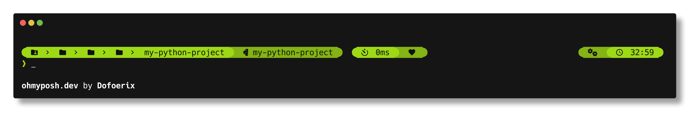
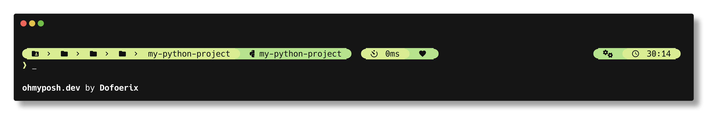

# Dofoerix' Prompt Theme

[Oh My Posh](https://github.com/JanDeDobbeleer/oh-my-posh) theme created to make the prompt more beautiful and convenient

## Variations

### By colors

Name of the folder with configuration files

#### Gray

#### Green

#### Light Green

#### Other

Other WIP themes variants can be found on [other-themes](https://github.com/Dofoerix/Dfrx-Prompt-Theme/tree/other-themes) branch

### By segments

`full`/`standard`/`light` in the name of the config file

#### Full

Segments list

- Current user
- Current folder 
- Git (displayed in the git repo)
- Language version (displayed in directory with Python file)[^1]
- Execution time
- Exit (broken heart if exit code ≠ 0)
- Root (displayed if the current user is root)
- Time

[^1]: At the moment this segment is only displayed with Python files

#### Standard

Segments list

- Current folder 
- Git (displayed in the git repo)
- Execution time
- Exit (broken heart if exit code ≠ 0)
- Root (displayed if the current user is root)
- Time (minutes and seconds if the prompt is transient)

#### Light

Segments list

- Current folder
- Execution time
- Exit (broken heart if exit code ≠ 0)
- Root (displayed if the current user is root)
- Time (minutes and seconds if the prompt is transient)

### By transient prompt

`no_tr` in the name of the config file means this feature is disabled in this variant

More info about transient prompt can be found [here](https://ohmyposh.dev/docs/configuration/transient)

## Usage

1. Install [Nerd Font](https://github.com/ryanoasis/nerd-fonts/releases/tag/v2.3.3) version 2.3.3 that you like and set it in your terminal

2. Install Oh My Posh for your system ([Windows](https://ohmyposh.dev/docs/installation/windows), [macOS](https://ohmyposh.dev/docs/installation/macos), [Linux](https://ohmyposh.dev/docs/installation/macos))

3. Clone this repository or download one of the configuration files to any folder

4. Set the theme using [this](https://ohmyposh.dev/docs/installation/customize#config-syntax) guide

   Replace `~/jandedobbeleer.omp.json` in the command with a path to any variant of this theme (e.g. `~/any-folder/Dfrx-Prompt-Theme/gray/full_no_tr.omp.json`)

   You can also use the URL of the raw file on GitHub instead of the path (e.g. `https://raw.githubusercontent.com/Dofoerix/Dfrx-Prompt-Theme/main/gray/full_no_tr.omp.json`)
